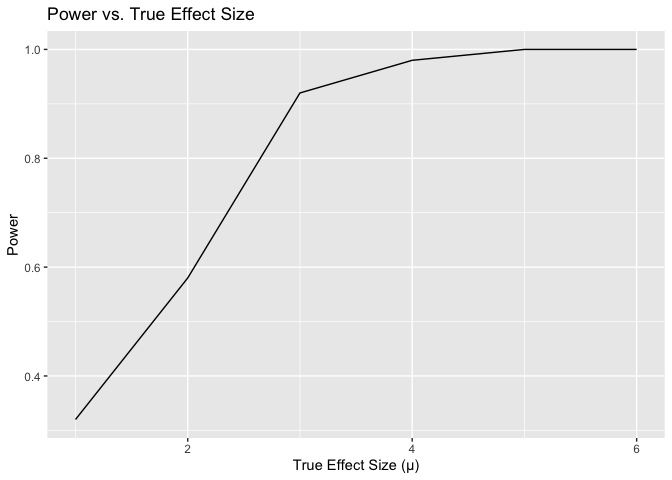

P8105_hw5_nk3037
================
Navya Koneripalli
2023-10-23

## Question 2

``` r
# Create a dataframe with all the file names
file_names = list.files(path = "./data", pattern = ".csv", full.names = TRUE)

# Separate arm and subject id and combie into a single dataframe
data = file_names %>%
  map_df(~ read.csv(.x) %>%
            mutate(subject_id = str_extract(basename(.x), "\\d+"),
                   arm = str_extract(basename(.x), "con|exp")))  
# Remove unnecessary columns and convert to numeric
tidy_data = data %>%
  gather(week, observation, -subject_id, -arm) %>%
  mutate(week = as.numeric(str_extract(week, "\\d+")),
         arm = recode(arm, "con" = "control", "exp" = "experimental"))

# Making the spaghetti plot
ggplot(tidy_data, aes(x = week, y = observation, color = subject_id)) +
  geom_line() +
  facet_wrap(~arm) +
  labs(title = "Spaghetti Plot of Observations Over Time For Each Subject",
       x = "Week",
       y = "Observation")
```

<!-- -->

The observations over time for each subject seem to be more constant for
the control arm and increase between weeks 2 and 8 for the experimental
arm. In general, patients in the control and experimental arm had
approximately the same starting observation at week 0. Patients, 02, 06
and 10 had a sudden decrease in observation values around week 5.
Similarly, patients 03, 05, 08 and 10 had a sudden decrease in
observation values around week 6. In general, the experimental arm had
some effect on the patients observation values, but I can’t say whether
it’s good or bad.

## Question 3

### For mu = 0

``` r
# Set seed for reproducibility
set.seed(1)

# Set design elements
n = 30
sigma = 5
alpha = 0.05
num_datasets = 5000
mu = 0

# One-sample t-test function
t_test_mu0 = function(data, true_mu) {
  t_test_result = t.test(data, mu = true_mu)
  tidy_result = broom::tidy(t_test_result)
  return(tidy_result)
}

# Generate 5000 datasets and store μ̂ and p-values
results = replicate(num_datasets, {
  sample_data = rnorm(n, mean = mu, sd = sigma)
  t_test_result = t_test_mu0(sample_data, true_mu = mu)
  c(estimate = t_test_result$estimate[1], p_value = t_test_result$p.value)
}, simplify = TRUE)

# Convert results to a data frame
results_df = as.data.frame(matrix(unlist(results), ncol = 2, byrow = TRUE))
colnames(results_df) = c("mu_hat", "p_value")
```

### For mu = 1, 2, 3, 4, 5, 6

``` r
# Set seed for reproducibility
set.seed(2)

# Set design elements
n = 30
sigma = 5
alpha = 0.05
num_datasets = 5000
mu_values = c(1, 2, 3, 4, 5, 6)

# One-sample t-test
t_test = function(data, true_mu) {
  t_test_result = t.test(data, mu = true_mu)
  tidy_result = broom::tidy(t_test_result)
  return(tidy_result)
}

# perform t-test for each of the 5000 datasets, and put results in a tibble
results = expand.grid(mu = mu_values, dataset = 1:num_datasets) %>%
  group_by(mu) %>%
  rowwise() %>%
  mutate(sample_data = list(rnorm(n, mean = mu, sd = sigma)),
         tidy_result = list(t_test(sample_data, true_mu = mu))) %>%
  ungroup() %>%
  tidyr::unnest(c(tidy_result, sample_data)) %>%
  mutate(reject_null = as.numeric(p.value < alpha))

# Calculated power and average mu_hat for each mu value
summary_stats = results %>%
  group_by(mu) %>%
  summarise(power = mean(reject_null, na.rm = TRUE),
            avg_mu_hat = mean(estimate, na.rm = TRUE),
            avg_mu_hat_rejected = mean(estimate * reject_null, na.rm = TRUE) / mean(reject_null, na.rm = TRUE))

# Plot power vs. true mu
ggplot(summary_stats, aes(x = mu, y = power)) +
  geom_line() +
  labs(title = "Power vs. True Effect Size",
       x = "True Effect Size (μ)",
       y = "Power")
```

<!-- -->

``` r
# Plot average mu_hat vs. true mu and average mu_hat in rejected cases
ggplot(summary_stats, aes(x = mu)) +
  geom_line(aes(y = avg_mu_hat), linetype = "solid") +
  geom_line(aes(y = avg_mu_hat_rejected), linetype = "dashed") +
  labs(title = "Average Estimate vs. True Effect Size",
       x = "True Effect Size (μ)",
       y = "Average Estimate of μ̂")
```

<!-- -->
**Describe the association between effect size and power.**

Generally, as the true effect size increases, the power increases as
well. However, in this case the effect sizes are pretty small and that
could be why we cannot see a clear trend in the association and more
difficult to detect a difference from the null hypothesis.

**Is the sample average of μ̂ across tests for which the null is rejected
approximately equal to the true value of μ? Why or why not?**

In the “Average Estimate vs. True Effect Size” plot:

- The solid line represents the average estimate of μ̂ across all
  simulations for each true value of μ.
- The dashed line represents the average estimate of μ̂ only in cases
  where the null hypothesis was rejected (power \> 0).

The sample average of μ̂ across rejected cases tends to be close to the
true value of μ but doesn’t match exactly probably because of sampling
variability and the errors that come with estimating population
parameters from a sample.
